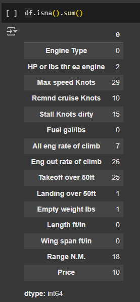
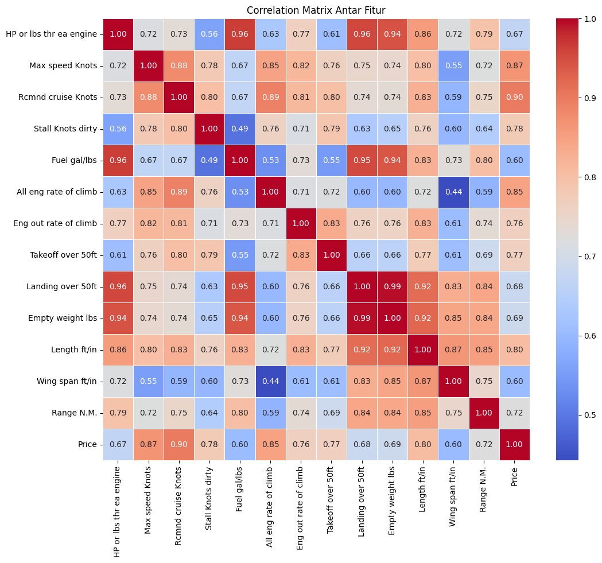
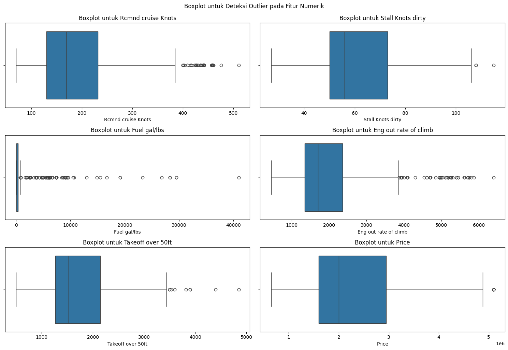
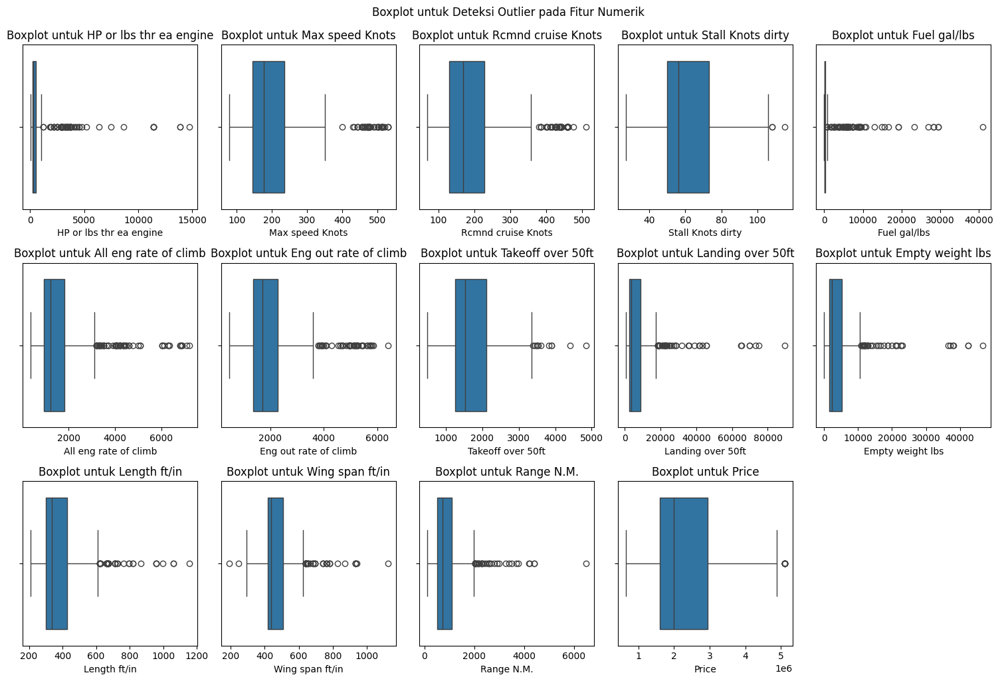
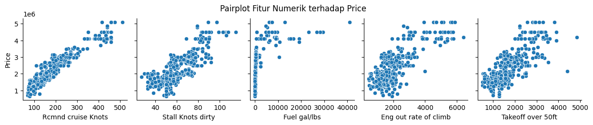

# Laporan Proyek Machine Learning - Cinta Chantika Lestari

## Domain Proyek
Industri penerbangan merupakan sektor yang dinamis dengan nilai aset tinggi, di mana harga pesawat menjadi faktor krusial dalam pengambilan keputusan bisnis. Dataset "Plane Price Prediction" dari Kaggle menyediakan dasar untuk mengembangkan model prediksi harga pesawat yang dapat membantu berbagai pemangku kepentingan dalam industri ini.
Pesawat sebagai aset jangka panjang dengan nilai ekonomis tinggi memerlukan metode penilaian yang akurat. Berdasarkan [1], valuasi pesawat yang tepat sangat penting bagi maskapai penerbangan, lessor, investor, dan perusahaan pembiayaan untuk mengoptimalkan keputusan pembelian, penjualan, dan leasing. Ketidakakuratan dalam memprediksi nilai pesawat dapat mengakibatkan kerugian finansial yang signifikan, dengan potensi kesalahan hingga jutaan dollar per unit pesawat.
Model regresi menjadi solusi efektif untuk prediksi harga pesawat karena beberapa alasan krusial. Volatilitas pasar pesawat bekas yang tinggi, dengan fluktuasi mencapai 15-20% dalam satu dekade terakhir [2], membuat prediksi manual rentan terhadap bias dan kurang efektif. Selain itu, model prediktif mendukung pengambilan keputusan berbasis data, yang ditekankan oleh Gibson dan Morrell [3] sebagai pendekatan analitik penting dalam akuisisi pesawat, menawarkan estimasi yang lebih objektif dibandingkan penilaian subjektif. Terakhir, model regresi meningkatkan efisiensi melalui Automated Valuation Model (AVM), yang dapat menghemat waktu dan sumber daya dibandingkan metode tradisional yang bergantung pada penilaian ahli [4].
## Business Understanding
### Problem Statements
Berdasarkan analisis terhadap industri penerbangan dan dataset yang digunakan, masalah utama yang diperoleh adalah:
1. Industri penerbangan menghadapi kesulitan dalam menentukan harga pasar yang tepat untuk pesawat, dengan potensi kesalahan valuasi yang dapat berdampak finansial signifikan hingga jutaan dollar per unit.
2. Harga pesawat dipengaruhi oleh kombinasi kompleks berbagai faktor teknis dan operasional yang sulit diintegrasikan dalam model penilaian manual atau tradisional.
3. Proses akuisisi pesawat bernilai miliaran dollar seringkali masih mengandalkan penilaian subjektif dan pengalaman daripada analisis kuantitatif yang ketat [3].
4. Terdapat kesenjangan informasi yang signifikan antara berbagai pemangku kepentingan dalam transaksi pesawat, mengakibatkan inefisiensi pasar dan potensi kesalahan penentuan harga.

### Goals
Dengan memanfaatkan algoritma machine learning, studi _predictive analysis_ ini bertujuan untuk:
1. Membangun model prediktif yang dapat memperkirakan harga pesawat dengan akurasi tinggi berdasarkan parameter teknis dan operasional.
2. Mengidentifikasi dan mengkuantifikasi faktor-faktor yang memiliki pengaruh paling signifikan terhadap valuasi pesawat.
3. Menyediakan alat yang dapat membantu proses pengambilan keputusan berbasis data untuk transaksi pesawat, perencanaan armada, dan strategi investasi.
4. Mengurangi asimetri informasi dalam pasar pesawat melalui estimasi harga yang lebih transparan dan objektif.

### Solution statements
Berdasarkan tujuan yang telah ditetapkan, proyek ini menyusun solusi dalam beberapa tahapan. Pertama, digunakan algoritma Random Forest Regressor untuk membangun model prediktif terhadap variabel harga pesawat berdasarkan sejumlah fitur teknis seperti kecepatan maksimum, daya dorong mesin, kapasitas bahan bakar, dan dimensi fisik. Pemilihan algoritma ini didasarkan pada performanya yang baik dalam menangani data non-linear dan fitur yang kompleks (telah dilakukan percobaan menggunakan model lain sebelumnya).
Selanjutnya, dilakukan tahapan eksplorasi data (EDA) untuk memahami struktur data, mengidentifikasi outlier, dan menganalisis korelasi antar fitur. Untuk meningkatkan performa model dan mengurangi kompleksitas, diterapkan teknik feature selection berdasarkan korelasi antar fitur serta relevansi terhadap target. Fitur yang menunjukkan korelasi sangat tinggi antar satu sama lain dipertimbangkan untuk dieliminasi guna menghindari multikolinearitas.
Untuk mengoptimalkan performa model, dilakukan tuning hyperparameter menggunakan teknik Grid Search. Proses ini memungkinkan pencarian kombinasi parameter terbaik dari Random Forest seperti jumlah pohon (n_estimators) dan kedalaman maksimum (max_depth) yang menghasilkan performa prediktif terbaik. Evaluasi akhir dilakukan menggunakan metrik seperti R-squared (R²) dan Root Mean Squared Error (RMSE) pada data uji.

## Data Understanding
Dataset yang digunakan dalam proyek ini bersumber dari platform Kaggle dengan judul Plane Price Prediction. Dataset ini memuat data spesifikasi teknis dari berbagai model pesawat terbang serta harga jual masing-masing unit, dan digunakan untuk membangun model regresi dalam rangka memprediksi harga pesawat berdasarkan karakteristik teknisnya.
Dataset terdiri dari 16 kolom fitur dan 517 baris data. Setiap baris merepresentasikan satu jenis pesawat yang berbeda.
Variabel-variabel pada dataset adalah sebagai berikut:
Model Name: Nama atau tipe model pesawat.
Engine Type: Jenis mesin yang digunakan pada pesawat, seperti Piston, Jet, dan Turboprop.
HP or lbs thr ea engine: Daya mesin dalam satuan horsepower (untuk piston/turboprop) atau dorongan dalam pound (untuk jet).
Max speed Knots: Kecepatan maksimum pesawat dalam satuan knot.
Rcmnd cruise Knots: Kecepatan jelajah yang direkomendasikan.
Stall Knots dirty: Kecepatan minimum sebelum kehilangan daya angkat (stall) dalam konfigurasi “dirty” (dengan flaps/gear terbuka).
Fuel gal/lbs: Kapasitas bahan bakar dalam galon atau pound.
All eng rate of climb: Laju pendakian (climb rate) saat semua mesin aktif.
Eng out rate of climb: Laju pendakian saat salah satu mesin mati.
Takeoff over 50ft: Jarak yang dibutuhkan untuk lepas landas hingga ketinggian 50 kaki.
Landing over 50ft: Jarak yang dibutuhkan untuk mendarat dari ketinggian 50 kaki.
Empty weight lbs: Berat kosong pesawat tanpa muatan.
Length ft/in: Panjang badan pesawat.
Wing span ft/in: Rentang sayap pesawat.
Range N.M.: Jarak tempuh maksimum pesawat dalam satuan nautical miles (N.M.).
Price: Harga pesawat (dalam USD), merupakan variabel target dalam model regresi ini.
### Proses Pemahaman Data
Untuk memahami struktur dan kualitas data, beberapa langkah Exploratory Data Analysis (EDA) dilakukan, antara lain:
- **Mengidentifikasi bentuk dataset, struktur, deskripsi fitur numerik**
- **Mengidentifikasi kategori _distinct/unique_**
  ```
  distinct_engine = df["Engine Type"].unique()
  print(distinct_engine)
  ```
- **Pemeriksaan missing values untuk memastikan kelengkapan data.**
  
  
- **Pemeriksaan duplikasi data**
- **Visualisasi hubungan antar fitur numerik menggunakan correlation heatmap untuk mengidentifikasi korelasi yang tinggi dengan variabel target (Price).**
   (Sebelum mengubah tipe data beberapa feature numerik)
   (Setelah mengubah tipe data)
- **Boxplot untuk mengidentifikasi outlier pada feature**
   (Sebelum mengubah tipe data beberapa feature numerik)
   (Setelah mengubah tipe data)
- **Pairplot untuk mengetahui bagaimana korelasi terhadap Price**
  
Tahapan ini memberikan dasar kuat untuk preprocessing lanjutan, seleksi fitur yang tepat, serta peningkatan performa model prediktif secara keseluruhan.

## Data Preparation
Teknik _data preparation_ atau _preprocessing_ yang dilakukan adalah:
- Menghilangkan feature yang tidak diperlukan, pada kasus ini adalah "Model Name" karena sifatnya yang _unique_ sehingga bukann fitur yang relevan untuk melakukan _predictive analysis_ regresi.
```
pred_columns = [col for col in df.columns if col != 'Model Name']
df = df[pred_columns]
```
- Mengubah tipe data ke numeric, supaya semua feature numerik seragam dan tidak terjadi kesalahan interpretasi data.
  ```
  for col in numeric_cols:
    # Menghilangkan koma dan spasi lalu ubah ke float
    df[col] = df[col].str.replace(',', '', regex=True)
    df[col] = pd.to_numeric(df[col], errors='coerce')
  def ft_in_to_inches(length):
    try:
        ft, inch = length.split('/')
        ft = int(ft)
        inch = int(inch)
        return ft * 12 + inch
    except:
        return np.nan
  ```
- Mengatasi nilai null pada fitur numerik, dengan cara mengisi nilai menggunakan nilai median fitur numerik tersebut
  ```
  numeric_cols = df.select_dtypes(include=[np.number]).columns
  df[numeric_cols] = df[numeric_cols].fillna(df[numeric_cols].median())
  ```
- Mengatasi outlier pada fitur yang memiliki korelasi tinggi terhadap Price, dengan cara capping
  ```
  for col in outlier_cols:
    df[col] = np.where(df[col] < lower_bound[col], lower_bound[col], df[col])
    df[col] = np.where(df[col] > upper_bound[col], upper_bound[col], df[col])
  ```
- Encoding fitur kategorik, agar

**Rubrik/Kriteria Tambahan (Opsional)**: 
- Menjelaskan proses data preparation yang dilakukan
- Menjelaskan alasan mengapa diperlukan tahapan data preparation tersebut.

## Modeling
Tahapan ini membahas mengenai model machine learning yang digunakan untuk menyelesaikan permasalahan. Anda perlu menjelaskan tahapan dan parameter yang digunakan pada proses pemodelan.

**Rubrik/Kriteria Tambahan (Opsional)**: 
- Menjelaskan kelebihan dan kekurangan dari setiap algoritma yang digunakan.
- Jika menggunakan satu algoritma pada solution statement, lakukan proses improvement terhadap model dengan hyperparameter tuning. **Jelaskan proses improvement yang dilakukan**.
- Jika menggunakan dua atau lebih algoritma pada solution statement, maka pilih model terbaik sebagai solusi. **Jelaskan mengapa memilih model tersebut sebagai model terbaik**.

## Evaluation
Pada bagian ini anda perlu menyebutkan metrik evaluasi yang digunakan. Lalu anda perlu menjelaskan hasil proyek berdasarkan metrik evaluasi yang digunakan.

Sebagai contoh, Anda memiih kasus klasifikasi dan menggunakan metrik **akurasi, precision, recall, dan F1 score**. Jelaskan mengenai beberapa hal berikut:
- Penjelasan mengenai metrik yang digunakan
- Menjelaskan hasil proyek berdasarkan metrik evaluasi

Ingatlah, metrik evaluasi yang digunakan harus sesuai dengan konteks data, problem statement, dan solusi yang diinginkan.

**Rubrik/Kriteria Tambahan (Opsional)**: 
- Menjelaskan formula metrik dan bagaimana metrik tersebut bekerja.

**---Ini adalah bagian akhir laporan---**

_Catatan:_
- _Anda dapat menambahkan gambar, kode, atau tabel ke dalam laporan jika diperlukan. Temukan caranya pada contoh dokumen markdown di situs editor [Dillinger](https://dillinger.io/), [Github Guides: Mastering markdown](https://guides.github.com/features/mastering-markdown/), atau sumber lain di internet. Semangat!_
- Jika terdapat penjelasan yang harus menyertakan code snippet, tuliskan dengan sewajarnya. Tidak perlu menuliskan keseluruhan kode project, cukup bagian yang ingin dijelaskan saja.
## Referensi
[1] Ackert, S. (2012). Aircraft valuation: A discussion and analysis of aircraft valuation methodologies and protocols. Aviation Consulting, Inc., 1(1), 14-28.
[2] International Air Transport Association. (2023). Aircraft Values Annual Report. IATA Economics, Montreal.
[3] Gibson, W. H., & Morrell, P. (2017). Theory and practice in aircraft financial evaluation. Journal of Air Transport Management, 10(6), 427-433. https://doi.org/10.1016/j.jairtraman.2017.02.008
[4] Forsberg, D., & Karlsson, J. (2021). Application of machine learning in aircraft valuation models. Journal of Air Transport Management, 94, 102078. https://doi.org/10.1016/j.jairtraman.2021.102078
