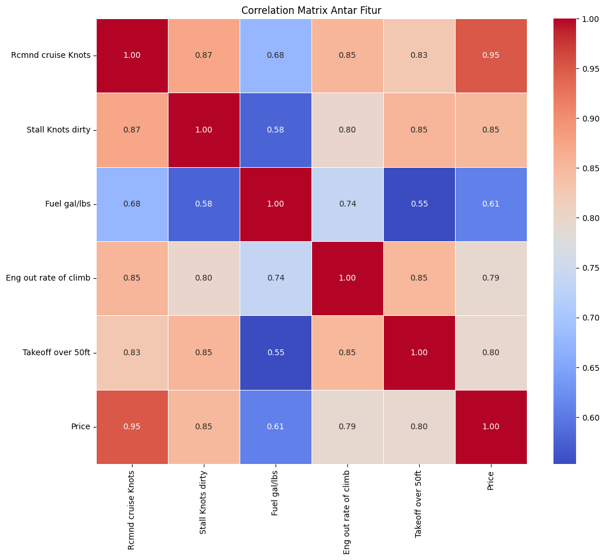

# Laporan Proyek Machine Learning - Cinta Chantika Lestari

## Domain Proyek
Industri penerbangan merupakan sektor yang dinamis dengan nilai aset tinggi, di mana harga pesawat menjadi faktor krusial dalam pengambilan keputusan bisnis. Dataset "Plane Price Prediction" dari Kaggle menyediakan dasar untuk mengembangkan model prediksi harga pesawat yang dapat membantu berbagai pemangku kepentingan dalam industri ini.
Pesawat sebagai aset jangka panjang dengan nilai ekonomis tinggi memerlukan metode penilaian yang akurat. Berdasarkan [1], valuasi pesawat yang tepat sangat penting bagi maskapai penerbangan, lessor, investor, dan perusahaan pembiayaan untuk mengoptimalkan keputusan pembelian, penjualan, dan leasing. Ketidakakuratan dalam memprediksi nilai pesawat dapat mengakibatkan kerugian finansial yang signifikan, dengan potensi kesalahan hingga jutaan dollar per unit pesawat.
Model regresi menjadi solusi efektif untuk prediksi harga pesawat karena beberapa alasan krusial. Volatilitas pasar pesawat bekas yang tinggi, dengan fluktuasi mencapai 15-20% dalam satu dekade terakhir [2], membuat prediksi manual rentan terhadap bias dan kurang efektif. Selain itu, model prediktif mendukung pengambilan keputusan berbasis data, yang ditekankan oleh Gibson dan Morrell [3] sebagai pendekatan analitik penting dalam akuisisi pesawat, menawarkan estimasi yang lebih objektif dibandingkan penilaian subjektif. Terakhir, model regresi meningkatkan efisiensi melalui Automated Valuation Model (AVM), yang dapat menghemat waktu dan sumber daya dibandingkan metode tradisional yang bergantung pada penilaian ahli [4].
## Business Understanding
### Problem Statements
Berdasarkan analisis terhadap industri penerbangan dan dataset yang digunakan, masalah utama yang diperoleh adalah:
1. Industri penerbangan menghadapi kesulitan dalam menentukan harga pasar yang tepat untuk pesawat, dengan potensi kesalahan valuasi yang dapat berdampak finansial signifikan hingga jutaan dollar per unit.
2. Harga pesawat dipengaruhi oleh kombinasi kompleks berbagai faktor teknis dan operasional yang sulit diintegrasikan dalam model penilaian manual atau tradisional.
3. Proses akuisisi pesawat bernilai miliaran dollar seringkali masih mengandalkan penilaian subjektif dan pengalaman daripada analisis kuantitatif yang ketat [3].
4. Terdapat kesenjangan informasi yang signifikan antara berbagai pemangku kepentingan dalam transaksi pesawat, mengakibatkan inefisiensi pasar dan potensi kesalahan penentuan harga.

### Goals
Dengan memanfaatkan algoritma machine learning, studi _predictive analysis_ ini bertujuan untuk:
1. Membangun model prediktif yang dapat memperkirakan harga pesawat dengan akurasi tinggi berdasarkan parameter teknis dan operasional.
2. Mengidentifikasi dan mengkuantifikasi faktor-faktor yang memiliki pengaruh paling signifikan terhadap valuasi pesawat.
3. Menyediakan alat yang dapat membantu proses pengambilan keputusan berbasis data untuk transaksi pesawat, perencanaan armada, dan strategi investasi.
4. Mengurangi asimetri informasi dalam pasar pesawat melalui estimasi harga yang lebih transparan dan objektif.

### Solution statements
Berdasarkan tujuan yang telah ditetapkan, proyek ini menyusun solusi dalam beberapa tahapan. Pertama, dilakukan tahapan eksplorasi data (EDA) untuk memahami struktur data, mengidentifikasi outlier, dan menganalisis korelasi antar fitur. Untuk meningkatkan performa model dan mengurangi kompleksitas, diterapkan teknik feature selection berdasarkan korelasi antar fitur serta relevansi terhadap target. Fitur yang menunjukkan korelasi sangat tinggi antar satu sama lain dipertimbangkan untuk dieliminasi guna menghindari multikolinearitas. Setelah itu, data melewati tahap preprocessing atau preparation berdasarkan insights yang diperoleh saat tahap EDA.
Selanjutnya, digunakan algoritma Linear Regression dan Random Forest Regressor untuk membangun model prediktif terhadap variabel harga pesawat berdasarkan sejumlah fitur teknis seperti kecepatan maksimum, daya dorong mesin, kapasitas bahan bakar, dan dimensi fisik.
Untuk mengoptimalkan performa model, dilakukan tuning hyperparameter menggunakan teknik Grid Search. Proses ini memungkinkan pencarian kombinasi parameter terbaik dari yang menghasilkan performa prediktif terbaik. Evaluasi akhir dilakukan menggunakan metrik seperti Mean AbsoluteError(MAE), R-squared (R²), dan Root Mean Squared Error (RMSE) pada data uji.

## Data Understanding
Dataset yang digunakan dalam proyek ini bersumber dari platform Kaggle dengan judul Plane Price Prediction [Plane Price Prediction Dataset di Kaggle](https://www.kaggle.com/datasets/rafsunahmad/plane-price-prediction). Dataset ini memuat data spesifikasi teknis dari berbagai model pesawat terbang serta harga jual masing-masing unit, dan digunakan untuk membangun model regresi dalam rangka memprediksi harga pesawat berdasarkan karakteristik teknisnya.
Dataset terdiri dari 16 kolom fitur dan 517 baris data. Setiap baris merepresentasikan satu jenis pesawat yang berbeda.
Variabel-variabel pada dataset adalah sebagai berikut:

Model Name: Nama atau tipe model pesawat.

Engine Type: Jenis mesin yang digunakan pada pesawat, seperti Piston, Jet, dan Turboprop.

HP or lbs thr ea engine: Daya mesin dalam satuan horsepower (untuk piston/turboprop) atau dorongan dalam pound (untuk jet).

Max speed Knots: Kecepatan maksimum pesawat dalam satuan knot.

Rcmnd cruise Knots: Kecepatan jelajah yang direkomendasikan.

Stall Knots dirty: Kecepatan minimum sebelum kehilangan daya angkat (stall) dalam konfigurasi “dirty” (dengan flaps/gear terbuka).

Fuel gal/lbs: Kapasitas bahan bakar dalam galon atau pound.

All eng rate of climb: Laju pendakian (climb rate) saat semua mesin aktif.

Eng out rate of climb: Laju pendakian saat salah satu mesin mati.

Takeoff over 50ft: Jarak yang dibutuhkan untuk lepas landas hingga ketinggian 50 kaki.

Landing over 50ft: Jarak yang dibutuhkan untuk mendarat dari ketinggian 50 kaki.

Empty weight lbs: Berat kosong pesawat tanpa muatan.

Length ft/in: Panjang badan pesawat.

Wing span ft/in: Rentang sayap pesawat.

Range N.M.: Jarak tempuh maksimum pesawat dalam satuan nautical miles (N.M.).

Price: Harga pesawat (dalam USD), merupakan variabel target dalam model regresi ini.

### Proses Pemahaman Data
Untuk memahami struktur dan kualitas data, beberapa langkah Exploratory Data Analysis (EDA) dilakukan, antara lain:
- **Mengidentifikasi bentuk dataset, struktur, statistik fitur numerik**
- **Mengidentifikasi kategori _distinct/unique_**
  ```
  distinct_engine = df["Engine Type"].unique()
  print(distinct_engine)
  ```
- **Pemeriksaan missing values untuk memastikan kelengkapan data.**
  
  
- **Pemeriksaan duplikasi data**
- **Visualisasi hubungan antar fitur numerik menggunakan correlation heatmap untuk mengidentifikasi korelasi yang tinggi dengan variabel target (Price).**
   (Sebelum mengubah tipe data beberapa feature numerik)
   (Setelah mengubah tipe data)
- **Boxplot untuk mengidentifikasi outlier pada feature**
   (Sebelum mengubah tipe data beberapa feature numerik)
   (Setelah mengubah tipe data)
- **Pairplot untuk mengetahui bagaimana korelasi terhadap Price**
  
Tahapan ini memberikan dasar kuat untuk preprocessing lanjutan, seleksi fitur yang tepat, serta peningkatan performa model prediktif secara keseluruhan.

## Data Preparation
Teknik _data preparation_ atau _preprocessing_ yang dilakukan adalah:
- Menghilangkan feature yang tidak diperlukan, pada kasus ini adalah "Model Name" karena sifatnya yang _unique_ sehingga bukann fitur yang relevan untuk melakukan _predictive analysis_ regresi.
  ```
  pred_columns = [col for col in df.columns if col != 'Model Name']
  df = df[pred_columns]
  ```
- Mengubah tipe data ke numerik, supaya semua feature numerik seragam dan tidak terjadi kesalahan interpretasi data.
  ```
  for col in numeric_cols:
    # Menghilangkan koma dan spasi lalu ubah ke float
    df[col] = df[col].str.replace(',', '', regex=True)
    df[col] = pd.to_numeric(df[col], errors='coerce')
  def ft_in_to_inches(length):
    try:
        ft, inch = length.split('/')
        ft = int(ft)
        inch = int(inch)
        return ft * 12 + inch
    except:
        return np.nan
  ```
- Standarisasi format teks (pada kasus ini "piston" diubah menjadi "Piston") tujuannya untuk  memastikan bahwa nilai yang sama diwakili dengan cara yang sama di seluruh dataset, sehingga algoritma tidak menganggap "piston" dan "Piston" sebagai dua kategori yang berbeda.
- Mengatasi nilai null pada fitur numerik, dengan cara mengisi nilai menggunakan nilai median fitur numerik tersebut. Ini perlu dilakukan karena jika ada nilai null, model akan error atau memberikan hasil yang tidak valid.
  ```
  numeric_cols = df.select_dtypes(include=[np.number]).columns
  df[numeric_cols] = df[numeric_cols].fillna(df[numeric_cols].median())
  ```
- Mengatasi outlier pada fitur yang memiliki korelasi tinggi terhadap Price, dengan cara capping untuk mempertahankan keberadaan data tersebut dalam dataset, namun membatasi pengaruh ekstremnya yang dapat mendistorsi statistik.
  ```
  for col in outlier_cols:
    df[col] = np.where(df[col] < lower_bound[col], lower_bound[col], df[col])
    df[col] = np.where(df[col] > upper_bound[col], upper_bound[col], df[col])
  ```
- Encoding fitur kategorik menjadi format numerik sehingga dapat dipahami dan diproses oleh algoritma Machine Learning.
  ```
  engine_dummies = pd.get_dummies(df['Engine Type'], prefix='Engine', drop_first=True)
  ```
- Feature selection menggunakan SelectKBest untuk mengeliminasi fitur multikolinear dengan tujuan meningkatkan akurasi model.
  ```
  # Feature selection
  selector = SelectKBest(score_func=f_regression, k=10)
  X_selected = selector.fit_transform(X, y)
  selected_features = X.columns[selector.get_support()]
  X = X[selected_features] 
  ```
- Splitting data untuk memisahkan dataset yang telah diolah menjadi train dan test untuk kemudian dilakukan training model.
  ```
  X_train, X_test, y_train, y_test = train_test_split(
    X, y, test_size=0.2, random_state=42
  )
  ```
- Standarisasi fitur numerik menggunakan **RobustScaler** untuk mengurangi dampak outlier pada penskalaan data. RobustScaler dipilih pada kasus ini dengan tujuan memastikan bahwa outlier tersebut tidak mendistorsi proses penskalaan.
  ```
  scaler = RobustScaler()
  # Fit dan transformasi data hanya pada kolom numerik
  X_train[numeric_cols] = scaler.fit_transform(X_train[numeric_cols])
  X_test[numeric_cols] = scaler.transform(X_test[numeric_cols])
  ```

## Modeling
Tahapan ini menjelaskan proses pemodelan machine learning yang digunakan untuk memprediksi harga pesawat berdasarkan berbagai fitur teknis. Dua algoritma regresi yang digunakan dalam proyek ini adalah Linear Regression dan Random Forest Regressor.
- Linear Regression :Linear Regression digunakan sebagai baseline model. Algoritma ini bekerja dengan mencari garis lurus terbaik yang meminimalkan selisih antara nilai aktual dan nilai prediksi (disebut residual). Kelebihannya terletak pada kesederhanaan, interpretabilitas, dan efisiensi komputasi. Namun, kelemahannya adalah kurang fleksibel dalam menangkap pola non-linear dalam data. Model ini dilatih menggunakan data training dan dievaluasi menggunakan metrik MAE, RMSE, dan R².
- Random Forest Regressor : Random Forest Regressor adalah algoritma ensemble yang membentuk banyak decision tree dan menggabungkan prediksi mereka. Model ini lebih baik dalam menangkap hubungan non-linear dan lebih robust terhadap overfitting. Selanjutnya, dilakukan hyperparameter tuning menggunakan GridSearchCV sehingga dapat menemukan kombinasi parameter yang optimal agar Random Forest dapat mencapai performa terbaik dan menghindari overfitting atau underfitting, dengan parameter sebagai berikut:

  n_estimators: [100, 200, 300]
  
  max_depth: [None, 10, 20]
  
  min_samples_split: [2, 5]
  
  min_samples_leaf: [1, 2]
  
  Kombinasi terbaik yang diperoleh adalah: 
  ```
  {'n_estimators': 300, 'max_depth': None, 'min_samples_split': 2, 'min_samples_leaf': 1}
  ```
### Pemilihan Model Terbaik
Hasil evaluasi menunjukkan bahwa Random Forest Regressor memiliki performa yang lebih baik dibandingkan Linear Regression berdasarkan ketiga metrik evaluasi yang digunakan. Oleh karena itu, model ini dipilih sebagai solusi akhir dalam proyek ini.


## Evaluation

### Metrik Evaluasi

Untuk mengevaluasi performa model regresi, digunakan tiga metrik utama:

1. **Mean Absolute Error (MAE)**  
   MAE mengukur rata-rata selisih absolut antara nilai prediksi dan nilai aktual. Metrik ini memberikan gambaran seberapa besar rata-rata kesalahan prediksi dalam satuan asli target (harga).  
   **Formula:**
   MAE = (1/n) × Σ |yᵢ - ŷᵢ|

2. **Root Mean Squared Error (RMSE)**  
   RMSE mengukur akar dari rata-rata kuadrat selisih antara nilai aktual dan nilai prediksi. RMSE lebih sensitif terhadap outlier dibanding MAE karena penalti kesalahan yang besar diperbesar secara kuadrat.  
   **Formula:**
   RMSE = sqrt((1/n) × Σ (yᵢ - ŷᵢ)²)

4. **R-squared (R²)**  
   R² mengukur seberapa besar variasi dalam data target yang dapat dijelaskan oleh model. Nilai R² berkisar antara 0 hingga 1. Semakin tinggi nilainya, semakin baik model dalam menjelaskan variasi data target.  
   **Formula:**
   R² = 1 - (Σ(yᵢ - ŷᵢ)² / Σ(yᵢ - ȳ)²)

### Hasil Evaluasi Model

| Model                           | MAE (↓)       | RMSE (↓)      | R² (↑)     |
|--------------------------------|---------------|---------------|------------|
| Linear Regression              | 314,165.48    | 427,787.68    | 0.8203     |
| Random Forest Regressor (best) | **243,975.85** | **352,628.35** | **0.8779** |

Model **Random Forest Regressor** yang telah dioptimasi dengan **GridSearchCV** menunjukkan performa yang lebih baik dibanding Linear Regression. Nilai R² sebesar 0.8779 mengindikasikan bahwa model mampu menjelaskan sekitar **87.8% variasi harga pesawat**. RMSE sebesar 352,628 menunjukkan bahwa kesalahan rata-rata prediksi berada pada kisaran $352,628, yang masih proporsional terhadap skala harga pesawat.

---

### Kesimpulan Evaluasi

Hasil evaluasi yang diperoleh menunjukkan bahwa model **Random Forest Regressor** menunjukkan performa yang lebih baik dibandingkan dengan Linear Regression. Hal ini dibuktikan dari:
- Nilai **MAE dan RMSE yang lebih rendah**, yang menandakan kesalahan prediksi yang lebih kecil secara rata-rata.
- Nilai **R² sebesar 0,8779**, yang menunjukkan bahwa model dapat menjelaskan sekitar **87,79% variasi pada data target**, dibandingkan dengan 82,03% pada Linear Regression.

- **Random Forest Regressor** adalah model terbaik karena memberikan prediksi yang lebih akurat (MAE dan RMSE lebih rendah serta R² lebih tinggi).
- Model ini mendukung tujuan dari proyek ini dengan:
  - Model prediktif yang dibuat menghasilkan harga pesawat dengan akurasi tinggi berdasarkan parameter teknis dan operasional.
  - Mengidentifikasi faktor-faktor penting yang memengaruhi valuasi pesawat.
  - Mendukung pengambilan keputusan bisnis berbasis data dalam transaksi pesawat, perencanaan armada, dan investasi.
  - Mengurangi asimetri informasi dalam pasar pesawat dengan estimasi harga yang transparan dan objektif sesuai data yang ada.

Dengan demikian, model yang dihasilkan tidak hanya baik secara metrik, tetapi juga **bernilai strategis dalam konteks bisnis dan industri penerbangan**.

---


## Referensi
[1] Ackert, S. (2012). Aircraft valuation: A discussion and analysis of aircraft valuation methodologies and protocols. Aviation Consulting, Inc., 1(1), 14-28.

[2] International Air Transport Association. (2023). Aircraft Values Annual Report. IATA Economics, Montreal.

[3] Gibson, W. H., & Morrell, P. (2017). Theory and practice in aircraft financial evaluation. Journal of Air Transport Management, 10(6), 427-433. https://doi.org/10.1016/j.jairtraman.2017.02.008

[4] Forsberg, D., & Karlsson, J. (2021). Application of machine learning in aircraft valuation models. Journal of Air Transport Management, 94, 102078. https://doi.org/10.1016/j.jairtraman.2021.102078
